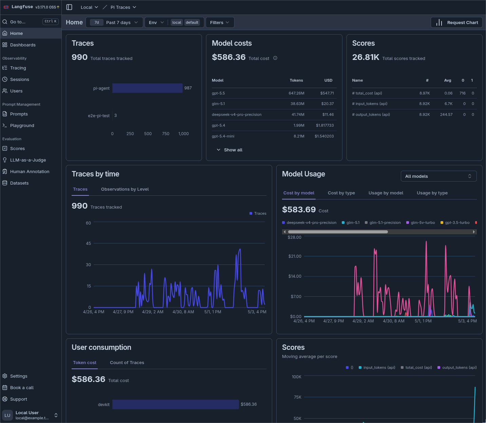
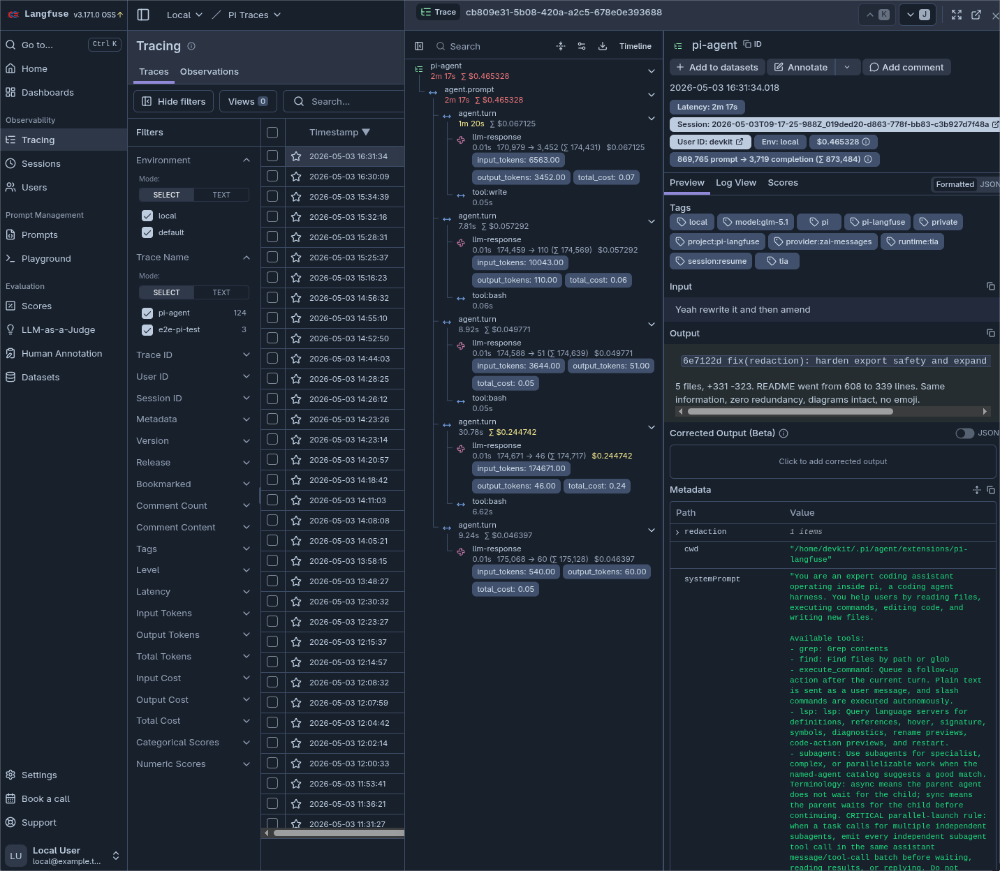

# pi-langfuse

Production-grade Langfuse observability for [Pi Coding Agent](https://github.com/mariozechner/pi-coding-agent).




## Features

- **Hierarchical Tracing**: Maps user prompts to per-turn spans and nested tool executions.
- **Streaming Generation**: Captures assistant responses as they stream.
- **LLM Metadata**: Records model, provider, token usage, and cost fields when pricing is configured.
- **Tool Observability**: Captures tool calls, sanitized arguments/results, and duration.
- **Session Correlation**: Groups prompts from the same Pi session into one Langfuse session.
- **Setup Wizard**: `/langfuse-init` configures either local self-hosted Langfuse or a remote/Langfuse Cloud endpoint.
- **Local-First Setup**: Local mode creates a self-hosted localhost Langfuse stack with generated secrets.
- **Autostart**: Once local init is complete, the extension starts Docker Compose on demand when tracing begins.
- **Raw Traces**: Optional redacted JSONL companion stream for training, distillation, and audit workflows.

## Quick Start

### Install

```bash
pi install git:github.com/edxeth/pi-langfuse
```

### Local self-hosted (recommended)

```text
/langfuse-init --yes --local
```

This creates a private Docker Compose stack with generated secrets. Defaults:

```text
URL:      http://localhost:3100/auth/sign-in
Email:    local@example.test
Name:     Local User
Password: local-langfuse
```

Files are written to `$PI_CODING_AGENT_DIR/langfuse/`. Init refuses to run in a non-empty directory.

After init, `pi` starts tracing on sessionful prompts. If local Langfuse is not healthy, the extension runs `docker compose up -d` automatically. Unpersisted/no-session runs are skipped by default.

Disable autostart for one process:

```bash
PI_LANGFUSE_AUTOSTART=0 pi
```

### Langfuse Cloud or existing instance

```text
/langfuse-init --yes --remote \
  --host https://cloud.langfuse.com \
  --public-key pk-lf-... \
  --secret-key sk-lf-...
```

Remote mode creates only `$PI_CODING_AGENT_DIR/langfuse/pi-langfuse.json`. No Docker files, no autostart.

You can also configure keys manually via env vars or settings. Configuration precedence:

1. `/extensions:settings` if the optional settings extension is installed
2. `$PI_CODING_AGENT_DIR/langfuse/pi-langfuse.json`
3. `config.json` in this extension
4. `LANGFUSE_*` environment variables

## Configuration

| Setting | Env Var | Default | Description |
| :--- | :--- | :--- | :--- |
| **Enabled** | - | `true` | Global toggle for tracing. |
| **Public Key** | `LANGFUSE_PUBLIC_KEY` | - | Langfuse project public key. |
| **Secret Key** | `LANGFUSE_SECRET_KEY` | - | Langfuse project secret key. |
| **Base URL** | `LANGFUSE_HOST` | `https://cloud.langfuse.com` | API host. Use `http://localhost:3100` for local. |
| **User ID** | `PI_LANGFUSE_USER_ID` | `$USER` | Associate traces with a specific user. |
| **Environment** | `PI_LANGFUSE_ENV` | - | Tag traces, e.g. `local`, `staging`, `production`. |
| **Release** | `PI_LANGFUSE_RELEASE` | - | Tag traces with a version or release ID. |
| **Local Autostart** | `PI_LANGFUSE_AUTOSTART` | `config dependent` | `0` disables Docker autostart, `1` forces it. |
| **Local Autostart Dir** | `PI_LANGFUSE_AUTOSTART_DIR` | `$PI_CODING_AGENT_DIR/langfuse` | Directory containing `docker-compose.yml`. |
| **Capture Provider Payload** | `PI_LANGFUSE_CAPTURE_PROVIDER_PAYLOAD` | `false` | Optional provider payload capture inside Langfuse metadata. |
| **Secret Redaction** | `PI_LANGFUSE_REDACTION` / `PI_LANGFUSE_UNREDACTED=1` | `true` | Redact known secrets and common token/PII-shaped patterns before Langfuse/raw-trace writes. Settings/config values take precedence over env opt-outs. |
| **Additional Redaction Secrets** | `PI_LANGFUSE_REDACTION_SECRETS` | - | Comma-separated literal secrets to redact in addition to env/config secrets. |
| **Raw Trace Export** | `PI_LANGFUSE_RAW_TRACE` | `false` | Redacted JSONL companion stream for training/distillation data. |
| **Raw Trace Directory** | `PI_LANGFUSE_RAW_TRACE_DIR` | `$PI_CODING_AGENT_DIR/langfuse/raw-traces` | Root directory for raw trace companion files. |

## Usage

### Toggle tracing

```text
/langfuse:toggle [on|off]
```

### Init options

```text
/langfuse-init --yes --local
/langfuse-init --yes --local --no-start
/langfuse-init --yes --remote --host https://cloud.langfuse.com --public-key pk-lf-... --secret-key sk-lf-...
/langfuse-init --dir ~/.pi/agent/langfuse
```

## Data flow

Every Pi event fans out to three destinations. Redaction happens at the `pi-langfuse` boundary -- Pi's own session file is never modified.

```text
                              YOU TYPE A PROMPT
                               pi "..."
                                      |
                   +------------------+------------------+
                   |                                     |
                   v                                     v
    +---------------------------+         +---------------------------+
    |   Pi session JSONL        |         |   pi-langfuse extension    |
    |   (Pi core writes this)   |         |                           |
    |                           |         |   sanitize() runs BEFORE  |
    |   Unredacted originals.  |         |   every write boundary    |
    |   pi-langfuse never       |         |                           |
    |   touches these.          |         |   Redacts: secrets, keys, |
    |                           |         |   tokens, PII, credentials|
    |   ~/.pi/agent/            |         |   blobs, assignments.     |
    |     sessions/             |         |                           |
    +---------------------------+         +------+------------+-------+
                                                 |            |
                                     +-----------+            +----------+
                                     v                                   v
                      +-------------------------+           +------------------+
                      |   Raw trace JSONL       |           |   Langfuse       |
                      |   (if enabled)          |           |   server         |
                      |                         |           |                  |
                      |   Append-only companion |           |   Local:         |
                      |   Redacted on write.   |           |   localhost:3100 |
                      |                         |           |   Cloud:         |
                      |   langfuse/raw-traces/  |           |   cloud.langfuse |
                      +-------------------------+           |                  |
                                                          |   Redacted on   |
                                                          |   send.         |
                                                          +------------------+
```

```text
Layer                    Redacted?   By whom?            When?
-----------------------  ----------  -----------------  ---------------
Pi session JSONL         NO          Pi core             On write
                         (originals) (untouchable)

Raw trace JSONL          YES         pi-langfuse         Before append
                         (companion) (sanitize->write)

Langfuse traces          YES         pi-langfuse         Before SDK send
                         (server)    (sanitize->send)

Export derivatives       YES         export pipeline     On copy
                         (output/)   (always-on)
```

### Trace hierarchy

```text
Trace (name: "pi-agent")
└── Span (name: "agent.prompt")
    └── Span (name: "agent.turn")
        ├── Generation (name: "llm-response")  <-- Cost/Token tracking
        └── Span (name: "tool:<name>")          <-- Arguments/Results
```

## Raw traces

Langfuse is optimized for observability, not training archives. UI fields can be truncated and traces may be restructured. Raw traces are the append-only JSONL companion for fine-tuning, distillation, and audit.

Enable in config:

```json
{
  "rawTraceEnabled": true,
  "rawTraceDir": "$PI_CODING_AGENT_DIR/langfuse/raw-traces"
}
```

Raw traces mirror Pi's session layout under `raw-traces/`:

```text
Pi session:   <agent-dir>/sessions/--project--/<session>.jsonl
Raw trace:    <agent-dir>/langfuse/raw-traces/--project--/<session>.jsonl
Fallback:     <agent-dir>/langfuse/raw-traces/--unknown--/<session>.jsonl
```

Record types: `session_start`, `agent_prompt_start`, `provider_request`, `tool_call`, `tool_result_first_seen`, `tool_execution_end`, `assistant_output`, `session_compact`.

The key record is `tool_result_first_seen`: it captures a bounded, redacted summary of tool output immediately, before later extensions can compress or rewrite it. Raw traces continue writing even if Langfuse tracing is disabled or the server is unavailable.

#### Session lifecycle

| Action | Raw trace behavior |
| :--- | :--- |
| Normal session | Writes one companion JSONL file with the same project directory and filename. |
| Display rename | No change; the session filename does not change. |
| Fork or clone | Starts a new raw trace file; parent evidence stays with the parent session. |
| Delete Pi session | Raw trace remains as training/audit evidence. |
| Manual filesystem move | Move the matching raw trace file yourself to keep paths mirrored. |

For a deep dive, see [docs/architecture.md](./docs/architecture.md).

## Export pipeline

Use `/langfuse:export` inside Pi for small exports, or the standalone `pi-langfuse-export` CLI for bulk exports. Originals are never modified.

```text
+-----------+    +-----------+    +------------+    +----------+
| DISCOVER  |--->|  COPY &   |--->|    SCAN    |--->|   GATE   |
|           |    |  REDACT   |    |            |    |          |
| Walk      |    |           |    | Built-in   |    | approved |
| sessions/ |    | JSON      |    | residual   |    | if 0     |
| raw-      |    | parse     |    | checks +   |    | findings |
| traces/   |    | per line  |    | TruffleHog |    |          |
+-----------+    +-----------+    +------------+    +-----+----+
                                                          |
                                                          v
+--------------------------------------------------------------+
|  ~/export/                                                    |
|                                                               |
|  sessions/           redacted Pi session copies              |
|  raw-traces/         redacted raw trace copies               |
|  manifest.jsonl      one record per exported file             |
|  approved.jsonl      approved file records                    |
|  rejected.jsonl      rejected file records                    |
|  training-index.jsonl approved redacted derivatives           |
|  report.json         scanner findings + approved/rejected     |
|  REVIEW.md           human review summary                     |
|                                                               |
|  Nothing uploaded. Nothing sent. Purely local.                |
+--------------------------------------------------------------+
```

### Inside Pi

```text
/langfuse:export
```

Synchronous -- convenient for small exports, but blocks the TUI during processing.

### Standalone CLI (recommended for bulk)

```bash
pi-langfuse-export \
  --sessions-dir ~/.pi/agent/sessions \
  --raw-dir ~/.pi/agent/langfuse/raw-traces \
  --out ~/export \
  --require-trufflehog
```

Streams progress to stderr, prints JSON summary to stdout. Speed depends on JSONL size, disk, and TruffleHog scan time. Large archives can take minutes.

Flags:

```text
--sessions-only           export sessions only
--raw-only                export raw traces only
--require-trufflehog      reject export if TruffleHog is unavailable
--no-trufflehog           skip external scan (local debug only)
```

### Export invariants

- Redaction is always on. `PI_LANGFUSE_UNREDACTED` and `redactionEnabled` only affect live telemetry, not exports.
- Absolute source paths are replaced with `[PATH_ROOT]`.
- Original files are never modified (read-only copy).

## Privacy

### Local setup

- Langfuse web/API binds to `127.0.0.1:3100`. Postgres, Redis, ClickHouse, and MinIO bind to localhost-only ports.
- Langfuse telemetry is disabled in the generated `.env` and Compose file.
- Cloud is not used unless you explicitly configure a cloud host/key pair.

This does not change where your LLM provider sends prompts.

### Redaction

Redaction is enabled by default. Every raw trace record includes `{ "redaction": { "applied": true } }`. Disable only for local debugging:

```bash
PI_LANGFUSE_UNREDACTED=1 pi
```

The sanitizer covers: configured secret keys, secret-like env values, `PI_LANGFUSE_REDACTION_SECRETS` literals, sensitive object fields, private-key blocks, bearer tokens, GitHub/HuggingFace/OpenAI/Anthropic/AWS/Stripe/SendGrid/Docker/Slack tokens, JWTs, `.env`-style assignments, URL-embedded credentials, email/phone/SSN/credit-card PII, data URLs, and large base64/hex blobs.

Even redacted traces can contain private business data that is not token-shaped. Treat raw traces as private.

### Old data

Redaction is forward-going. It does not rewrite old data.

| Existing data | After installing | Assume |
| :--- | :--- | :--- |
| Old Pi sessions | Unchanged | Contaminated originals. Use `/langfuse:export` for redacted copies. |
| Old raw traces | Unchanged | Reprocess before sharing, then archive or delete originals. |
| Old Langfuse traces | Unchanged | If secrets were sent, delete affected traces and rotate credentials. |

### Training workflow

Do not train from raw originals. Train from redacted derivative exports.

```text
Pi sessions + raw traces
  -> /langfuse:export
  -> redacted derivatives
  -> scan/review/filter
  -> normalize into training examples
  -> train/fine-tune/distill
```

### Known limitations

- **Canonical session rewrite**: Not done. Pi core owns session persistence. Use export for redacted copies.
- **Old Langfuse traces**: Not deleted automatically. Requires explicit operator action.
- **Binary/media payloads**: Redacted as strings when seen in telemetry. No OCR or forensic inspection.
- **Unknown secret formats**: Covered by configured literals, broad patterns, and export scanner. No scanner catches everything -- add literals via `PI_LANGFUSE_REDACTION_SECRETS`.
- **Semantic confidentiality**: PII patterns catch tokens and identifiers. Business-sensitive content needs human review before sharing.

## Troubleshooting

- **No traces?** Check `http://localhost:3100/api/public/health`, API keys, and Pi console warnings.
- **Docker did not start?** Run `docker compose up -d` inside the local Langfuse directory.
- **Wrong login?** Check the generated `.env` for `LANGFUSE_INIT_USER_EMAIL` and `LANGFUSE_INIT_USER_PASSWORD`.
- **Incomplete traces?** Ensure your Pi version supports `message_*`, tool, and session lifecycle events.
- **Cost is zero?** Token usage can be captured even when model pricing is not configured.
- **Large payloads in Langfuse UI?** Adjust the max-char limits in config/settings.
- **No raw trace file?** Check `rawTraceEnabled`, `rawTraceDir`, and that the run uses a persisted session rather than `--no-session`.

## License

MIT
